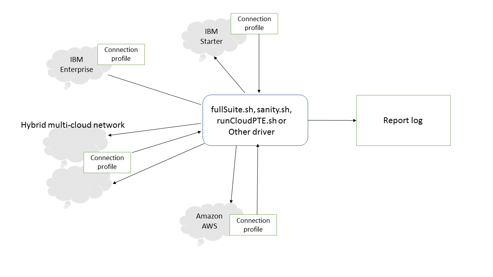

# Hyperledger Fabric Cloud Network Testing

You have found the home for test resources for cloud providers of Fabric.
All that is required is to produce a network connection profile, in order to leverage these automated tests and tools.
Currently we offer one test driver, and hope to offer more. Contributions are certainly welcome!

To make things even easier for network owners, anyone can supply additional supporting code that would
automatically create the connection profile of an existing network.
For example, we already have such content in the ./IBM directory designed to do that,
given the Network ID, for IBP (IBM Blockchain Platform) Starter networks; and plans are
in the works for similar functionality for Enterprise networks.
Support for other networks may follow, for those cloud providers who can offer the public APIs needed.

## Prerequisites

1. Install [Go](https://golang.org/doc/install) if necessary.

1. Git-clone fabric-test repository, and go to the cloud directory

    For example to git clone fabric-test release 1.1:

        cd $GOPATH/src/github.com/hyperledger
        git clone --single-branch -b release-1.1 https://github.com/hyperledger/fabric-test.git

        cd $GOPATH/src/github.com/hyperledger/fabric-test/testSuites/cloud/

1. Describe your network credential in a network.json

    Provide the network url, id, and certs for all organizations in a file named:

        .../fabric-test/testSuites/cloud/<IBM|AWS>/creds/network.json

    For example, for an IBM cloud network, create file

        fabric-test/testSuites/cloud/IBM/creds/network.json

    which would contain content similar to the following for a network containing 2 organizations:

        {
            "org1": {
                "url": "https://blockchain-starter.ng.bluemix.net",
                "network_id": "nb9ccaf8ee68a4fc5a76de88bf52d63bb",
                "key": "org1",
                "secret": "<secret 1>"
            },
            "org2": {
                "url": "https://blockchain-starter.ng.bluemix.net",
                "network_id": "nb9ccaf8ee68a4fc5a76de88bf52d63bb",
                "key": "org2",
                "secret": "<secret 2>"
           }
        }

1. Create Connection Profile (if needed)

    Steps to create a connection profile are cloud dependent. Some steps can be automated, and the tools can even do it for you, in some cases. Refer to the appropriate cloud-specific Readme section:

    * [IBM](https://github.com/hyperledger/fabric-test/tree/master/testSuite/cloud/IBM)

    * [AWS](https://github.com/hyperledger/fabric-test/tree/master/testSuite/cloud/AWS)

## Assumptions

To execute any of these tests, your network must contain

* channel: one channel, namely defaultchannel
* organization: two organizations, namely org1 and org2

## Introduction: Cloud PTE Test Driver
The cloud PTE test driver is designed to execute tests varying from health checks and sanity tests to load, stress, and performance tests.
There are some fully automated traffic scenario scripts that assume a certain minimum network topology.
Other scenarios may be added as desired.
We also have plans to offer an API for users to easily request their own customized test based on testing requirements.

The cloud PTE test driver is based on the [Performance Traffic Engine](https://github.com/hyperledger/fabric-test/tree/master/tools/PTE); it can be used to:

1. Run tests on any network in any supported cloud environment.
1. Select from a list of available traffic tests, using runCloudPTE.sh.
1. Or choose to easily run a predefined sanity test suite, sanity.sh.

The script, runCloudPTE.sh, can be used to optionally do any or all of the following:

* npm install fabric-client and fabric-ca-client
* generate connection profile of a given network and convert it to PTE service credential json
* install and instantiate chaincode
* execute selected PTE testcases

Note: testers can review the test report summary logs after each PTE test run at `fabric-test/tools/PTE/CITest/Logs/pteReport.log`

### Examples to execute tests

    ./sanity.sh --cprof <connection profile directory>

    ./fullSuite.sh --cprof <connection profile directory>

    ./runCloudPTE.sh --cprof <connection profile directory> -a

    ./runCloudPTE.sh --cprof /home/ibmadmin/gopath/src/github.com/hyperledger/fabric-test/testSuites/cloud/IBM/creds/connectionprofiles" -t FAB-7329-4i, FAB-7333-4i

## Future drivers