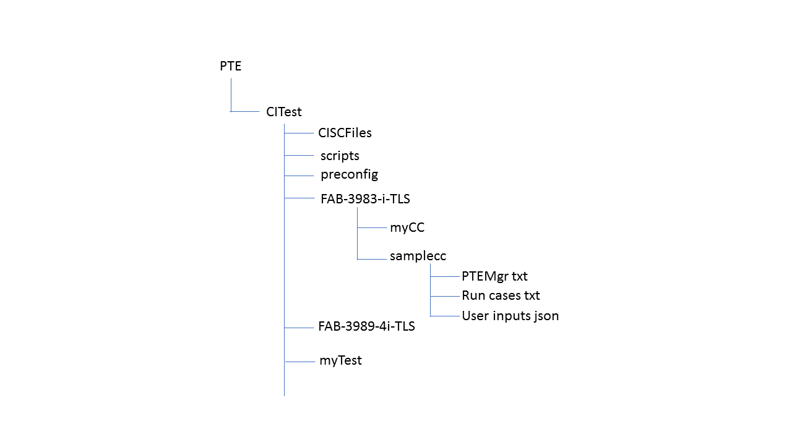

# Automation CI Test Using PTE

---
# Introduction

The purpose of this CI test is to automatically execute the predefined tests daily or weekly that any unexpected or undesired code changes may be uncovered as soon as possible.  The CI test uses [PTE](https://github.com/hyperledger/fabric-test/tree/master/tools/PTE) to driver transactions.  The functions of the CI tool include the following:

- setup PTE environment, see [PTE](https://github.com/hyperledger/fabric-test/tree/master/tools/PTE) for detail

- create Blockchain network using [Network Launcher](https://github.com/hyperledger/fabric-test/tree/master/tools/NL)

- pre-configure Blockchain network including create/join channels and install/instantiate chaincodes

- execute test cases

---
# Usage

The command is located in `PTE/CITest/scripts`

* ### command
 
        ./test_driver.sh [opt] [values]
            -e: environment setup, default=no"
            -n: create network, default=no"
            -c: preconfigure creation/join channel and install/instantiate chaincode, default=no"
            -s: synchup peer ledgers, recommended when network brought up, default=no"
            -t [values]: test cases to be executed"

* ### available test cases
        FAB-query-TLS: 4 processes X 1000 queries, TLS
        FAB-3983-i-TLS: FAB-3983, longrun: 4 processes X 60 hours invokes, constant mode, 1k payload, TLS
        FAB-4162-i-TLS: FAB-4162, longrun: 4 processes X 60 hours mix mode, vary 1k-2k payload, TLS
        FAB-4229-i-TLS: FAB-4229, longrun: 8 processes X 36 hours mix mode, vary 1k-2k payload, TLS
        FAB-3989-4i-TLS: FAB-3989, stress: 4 processes X 1000 invokes, constant mode, 1k payload, TLS
        FAB-3989-4q-TLS: FAB-3989, stress: 4 processes X 1000 queries, constant mode, 1k payload, TLS
        FAB-3989-8i-TLS: FAB-3989, stress: 8 processes X 1000 invokes, constant mode, 1k payload, TLS
        FAB-3989-8q-TLS: FAB-3989, stress: 8 processes X 1000 queries, constant mode, 1k payload, TLS
        robust-i-TLS: robustness: 4 processes X invokes, constant mode, 1k payload, TLS

* ### Examples

    - The following command will create a network, create/join channels and install/instantiate chaincode and execute test cases: FAB-3989-4i-TLS and FAB-3989-4q-TLS.

            ./test_driver.sh -n -c -t FAB-3989-4i-TLS FAB-3989-4q-TLS

    - The following command will create/join channel and install/instantiate chaincode and execute test case: FAB-3989-4i-TLS.

            ./test_driver.sh -c -t FAB-3989-4i-TLS

    - The following command will execute test cases: FAB-3989-4i-TLS, FAB-3989-4q-TLS, and robust-i-TLS.

            ./test_driver.sh -t FAB-3989-4i-TLS FAB-3989-4q-TLS robust-i-TLS

---
# chaincode

Currently, only [samplecc](https://github.com/hyperledger/fabric-test/tree/master/chaincodes/samplecc/go) is supported in this test.  More chaincodes will be supported in the future.

---
# directory structure

The directory structure of the CI test is shown in the diagram.

- PTE: PTE directory under fabric-sk-node/test
     - CITest: CI test direcotry
          - SCFiles: contains all service credentials json
          - scripts: all bash scritps
          - preconfig: PTE run cases and user inputs for create/join channels and install/instantiate chaincode
          - FAB-3983-i-TLS: test case
               * samplecc: contains PTEMgr txt, run cases txt, and use inputs json for chaincode samplecc
               * myCC: contains PTEMgr txt, run cases txt, and use inputs json for chaincode myCC
          - FAB-3989-4i-TLS: test case
          - myTest: a user customized test case

---
# Customized Test

The tool allows users to create a customize test case easily.  For example, the user wants to execute a test case, namely myTest, with chaincode, myCC.  He can simply follows the steps below.

- create a test directory, namely `myTest`, under `PTE/CITest`, see diagram above
- create a chaincode directory, namely `myCC`, under `PTE/CITest/myTest`
- create a test directory, namely MyCase, under `PTE/CITest/myTest/myCC`
- create PTE manager, run cases, and user inputs under `PTE/CITest/myTest/myCC/MyCase` based on his test scenarios
- go to `PTE/CITest/scripts`
- execute command `./test_driver.sh -t myTest`

It will be easier to copy and change an available test case. 

---

 This work is licensed under a <a rel="license" href="http://creativecommons.org/licenses/by/4.0/">Creative Commons Attribution 4.0 International License</a>.
