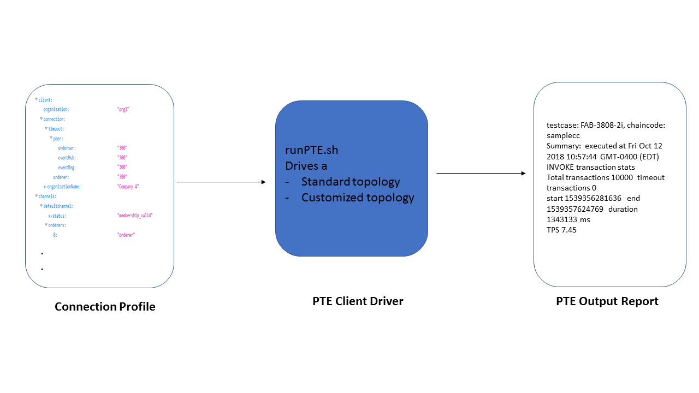

# Hyperledger Fabric Network Testing

## Summary
You have found the home for automated testing a fabric network in any topology.
Currently, we use the [Performance Traffic Engine (PTE)](https://github.com/hyperledger/fabric-test/tree/release-1.1/tools/PTE)
as the client driver.
The script runPTE.sh invokes the PTE tool to execute a user-selected set of tests
using a connection profile provided as input.
The connection profile may be based on the fabric deployment of choice (cloud offering, Cello, K8S or customized deployment).
For reference, a sample connection profile is provided in ./connectionprofile/. We provide a default set of eight scenarios that run on a topology described below.
Here is a basic diagram depicting the flow.

## Introduction to PTE Network Test Driver
The PTE network test driver is designed to execute tests varying from
health checks and sanity tests to load, stress, and performance tests.
The runPTE.sh provides many valuable functions to ensure successful execution such as:

* npm install fabric-client and fabric-ca-client
* convert connection profiles to PTE service credential json
* install and instantiate chaincode
* execute selected PTE testcases

You can use the --help option in the script for more details.

Upon completion, testers can review the test report summary logs for each PTE test run
at `fabric-test/tools/networktest/Logs/pteReport*.log`

## Prerequisites

1. Git-clone fabric-test repository, and go to the networktest directory

    For example, to set up fabric-test in release 1.1:

        cd $GOPATH/src/github.com/hyperledger
        git clone --single-branch -b release-1.1 https://github.com/hyperledger/fabric-test.git

        cd fabric-test/tools/networktest

1. Connection Profile

    You need to create a directory to store all your connection profiles for your network.
    Or, you may use the default directory, ./connectionprofile/ and replace the sample files there.
    The fully automated tests assume a specific network topology to be defined in the
    connection profile, and the network should be running already.
    The topology **MUST** include:

    * one channel, namely defaultchannel
    * two organizations, namely org1 and org2, as members of defaultchannel
    * a minimum of 1 peer in each org that has joined defaultchannel

## Examples

   The script requires either -a to execute all tests or -t <testcase ...> to execute selected tests.

   Here is an example to run all tests defined in the automated test suite using your connection profile provided in the ./connectionprofile directory.

        ./runPTE.sh -a

   Here is an example to run a sanity test of two testcases defined in the automated test suite using your connection profile provided in the ./connectionprofile directory.

        ./runPTE.sh -s

   For more help, execute

        ./runPTE.sh -h

   For an overview of all testcases refer to [CITest](https://github.com/hyperledger/fabric-test/tree/master/tools/PTE/CITest). To understand a particular testcase, here is a sample [description](https://jira.hyperledger.org/browse/FAB-3808) and [configuration](https://github.com/hyperledger/fabric-test/tree/master/tools/PTE/CITest/FAB-3808-2i).  We welcome any new testcase contributions.

